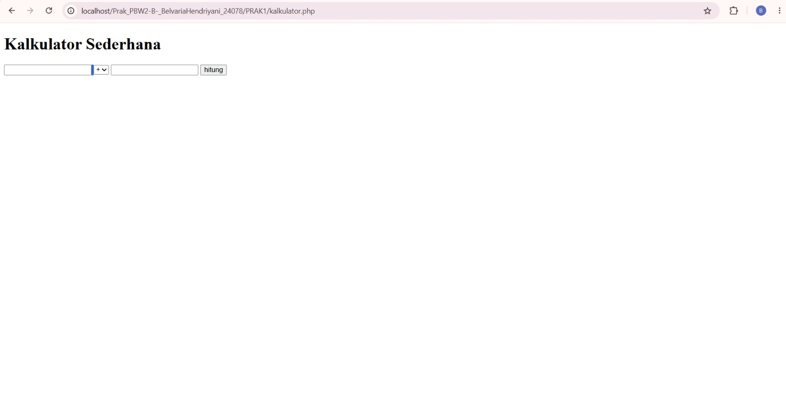
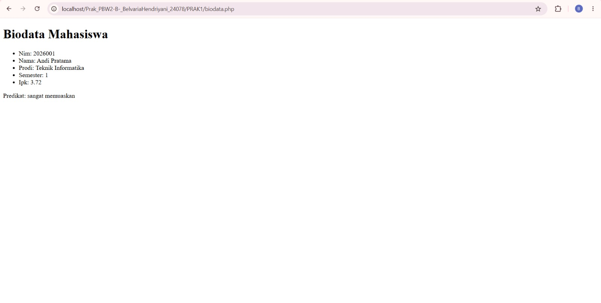
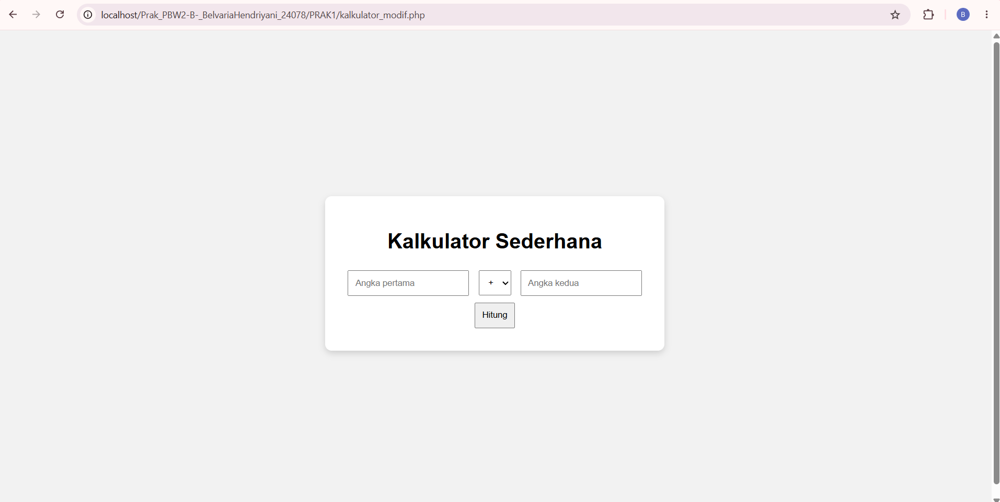
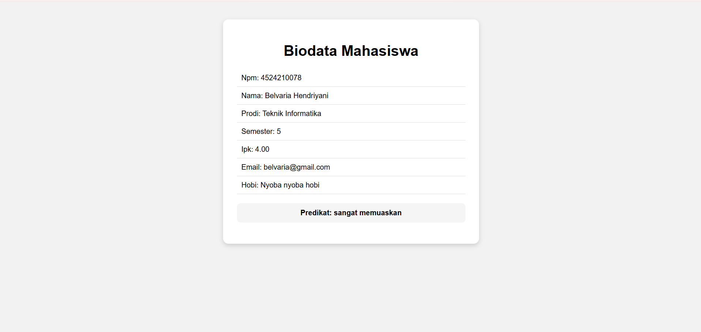

# TUGAS 1 - PRAKTIKUM PEMROGRAMAN BERBASIS WEB
 
| Data   | Keterangan          |
|--------|----------------------|
| Nama   | Belvaria Hendriyani  |
| NPM    | 4524210078           |
 
---
 
## Daftar Isi
 
1. [Menjalankan Contoh Pertemuan 1](#1-menjalankan-contoh-pertemuan-1)
2. [Modifikasi Program](#2-modifikasi-program)
3. [Penjelasan 5 Bagian Kode Terpenting](#3-penjelasan-5-bagian-kode-terpenting)
4. [Screenshot Sebelum dan Sesudah Modifikasi](#4-screenshot-sebelum-dan-sesudah-modifikasi)
   
---
 
## 1. Menjalankan Contoh Pertemuan 1
 
Pada Praktikum Pertemuan 1 terdapat dua contoh program yang dijalankan, yaitu:
 
1. `kalkulator.php`
2. `biodata.php`
Kedua program berhasil dijalankan menggunakan **Laragon** dan menghasilkan output tanpa error kritis.
 
### 1.1 Kalkulator
 
Program `kalkulator.php` merupakan kalkulator sederhana yang dapat melakukan operasi:
 
- Penjumlahan (`+`)
- Pengurangan (`-`)
- Perkalian (`*`)
- Pembagian (`/`)
Program menerima input melalui form dengan method `POST`, memproses operasi menggunakan struktur `switch`, dan memiliki validasi untuk mencegah pembagian dengan angka nol (menampilkan pesan *"Pembagian dengan nol tidak diperbolehkan."*).
 
**Screenshot Output Awal Kalkulator**
 

 
### 1.2 Biodata
 
Program `biodata.php` digunakan untuk menampilkan data mahasiswa. Data disimpan dalam array asosiatif `$mahasiswa` (nim, nama, prodi, semester, ipk), kemudian ditampilkan menggunakan perulangan `foreach`. Predikat kelulusan ditentukan oleh function `statuskelulusan()` berdasarkan nilai IPK.
 
**Screenshot Output Awal Biodata**
 

 
---
 
## 2. Modifikasi Program
 
### 2.1 Modifikasi Program Kalkulator
 
#### Modifikasi 1 - Menambahkan Operasi Pangkat
 
Pada program awal, operator yang tersedia hanya `+  -  *  /`. Ditambahkan operator baru `^` untuk operasi pangkat dengan menambahkan `case` baru pada struktur `switch`, serta menambahkan opsi `^` pada elemen `<select>` di form.
 
```php
// MODIFIKASI 1: Menambahkan operasi pangkat
case '^':
    $hasil = $a ** $b;
    break;
```
 
#### Modifikasi 2 - Styling Tampilan dan Menampilkan Ekspresi Lengkap
 
Tampilan form awal masih polos. Ditambahkan `<style>` internal berupa `flexbox` untuk memusatkan tampilan, kartu (`.kalkulator`) dengan `border-radius` dan `box-shadow`, serta jarak antar elemen input.
 
Selain itu, output hasil dimodifikasi agar menampilkan ekspresi perhitungan secara lengkap (`a operator b = hasil`), bukan hanya nilai hasilnya saja:
 
```php
<p class="hasil">
    Hasil:
    <?= htmlspecialchars((string)$a) ?>
    <?= htmlspecialchars($operator) ?>
    <?= htmlspecialchars((string)$b) ?>
    =
    <?= htmlspecialchars((string)$hasil) ?>
</p>
```
 
### 2.2 Modifikasi Program Biodata
 
#### Modifikasi 1 - Menambahkan Field Data Baru
 
Pada array `$mahasiswa`, ditambahkan dua data baru yaitu `email` dan `hobi`, selain data awal (npm, nama, prodi, semester, ipk):
 
```php
// MODIFIKASI 1: Menambahkan data baru
'email' => 'belvaria@gmail.com',
'hobi'  => 'Nyoba nyoba hobi',
```
 
Karena data ditampilkan dengan `foreach`, field baru ini otomatis muncul di halaman tanpa perlu mengubah bagian tampilan.
 
#### Modifikasi 2 - Styling Tampilan
 
Ditambahkan `<style>` internal untuk mempercantik tampilan biodata: kartu `.biodata` dengan lebar tetap, `border-radius`, dan `box-shadow`, daftar (`<ul>`/`<li>`) tanpa bullet dengan pembatas antar baris (`border-bottom`), serta kotak khusus (`.predikat`) untuk menonjolkan hasil predikat kelulusan.

  
---
 
## 3. Penjelasan 5 Bagian Kode Terpenting
 
| No | Bagian Kode | File | Penjelasan Singkat |
|----|-------------|------|---------------------|
| 1 | `switch ($operator) { ... }` | kalkulator.php | Menentukan jenis operasi matematika (`+ - * /`) yang dijalankan berdasarkan pilihan pengguna pada form. Ini adalah inti logika kalkulator. |
| 2 | Validasi `if ($b == 0)` | kalkulator.php | Mencegah error *division by zero* dengan memeriksa nilai pembagi sebelum operasi pembagian dijalankan, dan menampilkan pesan kesalahan yang ramah pengguna jika nilainya nol. |
| 3 | `case '^': $hasil = $a ** $b;` | kalkulator_modif.php | Bagian hasil modifikasi yang menambahkan operasi pangkat menggunakan operator `**` bawaan PHP, menunjukkan bagaimana fitur baru ditambahkan tanpa mengubah struktur program secara keseluruhan. |
| 4 | `foreach ($mahasiswa as $kunci => $nilai)` | biodata.php | Melakukan perulangan pada array asosiatif untuk menampilkan seluruh pasangan key-value data mahasiswa secara dinamis, sehingga jika ada field baru ditambahkan, tampilan otomatis menyesuaikan. |
| 5 | `function statuskelulusan(float $ipk): string { ... }` | biodata.php | Menentukan predikat kelulusan mahasiswa (sangat memuaskan / memuaskan / perlu peningkatan) berdasarkan nilai IPK menggunakan struktur kondisi `if` bertingkat dengan *early return*. |
 
---
 
## 4. Screenshot Sebelum dan Sesudah Modifikasi
 
### 4.1 Kalkulator
 
| Sebelum Modifikasi | Sesudah Modifikasi |
|---------------------|----------------------|
|  |  |
 
### 4.2 Biodata
 
| Sebelum Modifikasi | Sesudah Modifikasi |
|---------------------|----------------------|
|  |  |
 
 
 